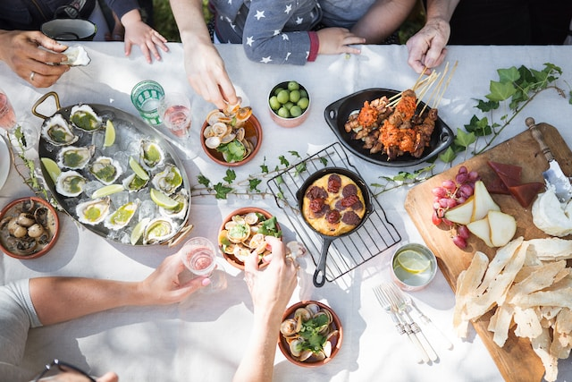

# Urban Eats Lounge (UEL) - Website Reservasi Restoran



Sebuah sistem reservasi online untuk restoran **Urban Eats Lounge** yang memungkinkan pelanggan untuk melakukan reservasi meja, memilih menu, dan mengelola pesanan dengan mudah.

## 📋 Deskripsi Proyek

Urban Eats Lounge (UEL) atau Rm Daeng adalah sistem web berbasis PHP yang dirancang untuk mengelola reservasi restoran. Website ini menyediakan platform yang user-friendly untuk pelanggan dalam melakukan pemesanan tempat dan menu, serta dashboard admin untuk mengelola semua reservasi.

### Fitur Utama

- **🏠 Landing Page** - Halaman utama dengan informasi restoran
- **📋 Menu Digital** - Katalog makanan dan minuman dengan harga
- **📅 Sistem Reservasi** - Form reservasi dengan pilihan tipe ruangan
- **💳 Pembayaran** - Sistem pembayaran terintegrasi
- **👨‍💼 Dashboard Admin** - Panel admin untuk mengelola reservasi
- **✏️ CRUD Operations** - Create, Read, Update, Delete reservasi
- **🏪 Multi Room Type** - Outdoor, Indoor, dan Private Room

## 🛠️ Teknologi yang Digunakan

### Frontend
- **HTML5** - Struktur halaman web
- **CSS3** - Styling dan layout responsif
- **JavaScript** - Interaktivitas dan validasi form
- **Font Awesome** - Icons
- **Swiper.js** - Image slider
- **Google Fonts** - Typography (Poppins)

### Backend
- **PHP** - Server-side programming
- **MySQL** - Database management
- **MySQLi** - Database connection

### Tools & Libraries
- **Feather Icons** - Icon set
- **Responsive Design** - Mobile-friendly interface

## 📁 Struktur Proyek

```
RmDaeng/
├── 📄 index.php              # Halaman utama
├── 📄 menu.php               # Halaman menu restoran
├── 📄 dashboard.php          # Dashboard admin
├── 📄 config.php             # Konfigurasi database
├── 📄 proses_reservasi.php   # Proses booking reservasi
├── 📄 pembayaran.php         # Halaman pembayaran
├── 📄 edit.php               # Edit reservasi
├── 📄 hapus.php              # Hapus reservasi
├── 📄 loginuser.php          # Login user
├── 📄 registeruser.php       # Registrasi user
├── 📄 logout.php             # Logout
├── 📁 css/                   # File styling
│   ├── style.css             # Style utama
│   ├── menu.css              # Style menu
│   ├── dashboard.css         # Style dashboard
│   └── ...                   # CSS lainnya
├── 📁 js/                    # JavaScript files
│   ├── script.js             # Script utama
│   ├── dashboard.js          # Script dashboard
│   └── ...                   # JS lainnya
├── 📁 img/                   # Gambar dan assets
│   ├── bg/                   # Background images
│   └── ...                   # Image files
└── 📁 assest/                # File backup/alternative
```

## ⚙️ Installation & Setup

### Prerequisites
- **XAMPP/WAMP/LAMP** - Local server environment
- **PHP 7.4+**
- **MySQL 5.7+**
- **Web Browser** (Chrome, Firefox, Safari)

### Langkah Instalasi

1. **Clone Repository**
   ```bash
   git clone https://github.com/salsabilaputri95/RmDaeng-Projek-Website-.git
   cd RmDaeng
   ```

2. **Setup Database**
   - Buka phpMyAdmin atau MySQL client
   - Buat database baru dengan nama `uel`
   ```sql
   CREATE DATABASE uel;
   ```

3. **Import Database Schema**
   - Import file SQL jika tersedia, atau buat tabel manual:
   ```sql
   USE uel;
   
   CREATE TABLE reservasi (
       reservasi_id INT AUTO_INCREMENT PRIMARY KEY,
       user_id INT,
       nama VARCHAR(100) NOT NULL,
       no_telepon VARCHAR(15) NOT NULL,
       tipe_ruangan VARCHAR(50) NOT NULL,
       jumlah_kursi INT NOT NULL,
       menu TEXT,
       pesan_tambahan TEXT,
       tanggal_waktu DATETIME NOT NULL,
       created_at TIMESTAMP DEFAULT CURRENT_TIMESTAMP
   );
   ```

4. **Konfigurasi Database**
   - Edit file `config.php` sesuai dengan pengaturan database Anda:
   ```php
   $host = "localhost";
   $username = "root";  // Username MySQL Anda
   $password = "";      // Password MySQL Anda
   $database = "uel";
   ```

5. **Jalankan Server**
   - Pastikan Apache dan MySQL sudah berjalan di XAMPP
   - Akses: `http://localhost/RmDaeng/`

## 💻 Penggunaan

### Untuk Pelanggan
1. **Buka Website** - Akses halaman utama
2. **Lihat Menu** - Browse menu makanan dan minuman
3. **Buat Reservasi** - Isi form reservasi dengan detail:
   - Nama dan nomor telepon
   - Tipe ruangan (Outdoor/Indoor/Private Room)
   - Jumlah kursi
   - Menu yang diinginkan
   - Tanggal dan waktu
   - Pesan tambahan
4. **Pembayaran** - Lakukan pembayaran untuk konfirmasi

### Untuk Admin
1. **Login Dashboard** - Akses panel admin
2. **Kelola Reservasi** - View, edit, atau hapus reservasi
3. **Monitor Data** - Pantau statistik reservasi

## 🏪 Tipe Ruangan

| Tipe Ruangan | Harga | Kapasitas | Deskripsi |
|--------------|-------|-----------|-----------|
| **Outdoor** | Rp 200.000 | Fleksibel | Ruangan terbuka dengan suasana alami |
| **Indoor** | Rp 300.000 | Fleksibel | Ruangan ber-AC dengan suasana nyaman |
| **Private Room** | Rp 500.000 | Eksklusif | Ruangan pribadi untuk acara khusus |

## 🍽️ Sample Menu

### Makanan
- **Fried Rice** - IDR 30.000
- **Grilled Chicken** - IDR 45.000
- **Ramen** - IDR 30.000
- **Steak** - IDR 70.000
- **Vegetable Salad** - IDR 30.000

### Minuman
- **Es Teh** - IDR 8.000
- **Es Jeruk** - IDR 10.000
- **Jus Alpukat** - IDR 15.000
- **Coffee** - IDR 12.000

## 🔧 Fitur Teknis

- **Responsive Design** - Kompatibel dengan desktop, tablet, dan mobile
- **Form Validation** - Validasi input client-side dan server-side
- **Database Security** - Prepared statements untuk mencegah SQL injection
- **Session Management** - Sistem login/logout yang aman
- **CRUD Operations** - Operasi database lengkap
- **Date/Time Picker** - Input tanggal dan waktu yang user-friendly

## 🛡️ Keamanan

- Prepared statements untuk database queries
- Input validation dan sanitization
- Session-based authentication
- Error handling yang proper
- XSS protection

## 🚀 Future Enhancements

- [ ] Sistem notifikasi email/SMS
- [ ] Payment gateway integration
- [ ] Customer review system
- [ ] Multi-language support
- [ ] Mobile app version
- [ ] Advanced reporting dashboard
- [ ] Inventory management
- [ ] Staff scheduling system

## 📞 Kontak & Support

**Urban Eats Lounge**
- **Alamat**: [Alamat Restoran]
- **Telepon**: [Nomor Telepon]
- **Email**: [Email Restoran]
- **Website**: [URL Website]

## 👥 Tim Pengembang

- **rockmind** - Pengembang Utama - [GitHub](https://github.com/salsabilaputri95/)


## 🙏 Acknowledgments

- Font Awesome untuk icon set
- Google Fonts untuk typography
- Swiper.js untuk image slider
- Feather Icons untuk additional icons
- Bootstrap untuk styling framework

---

**© 2023 Website Reservasi - Rm Daeng**
